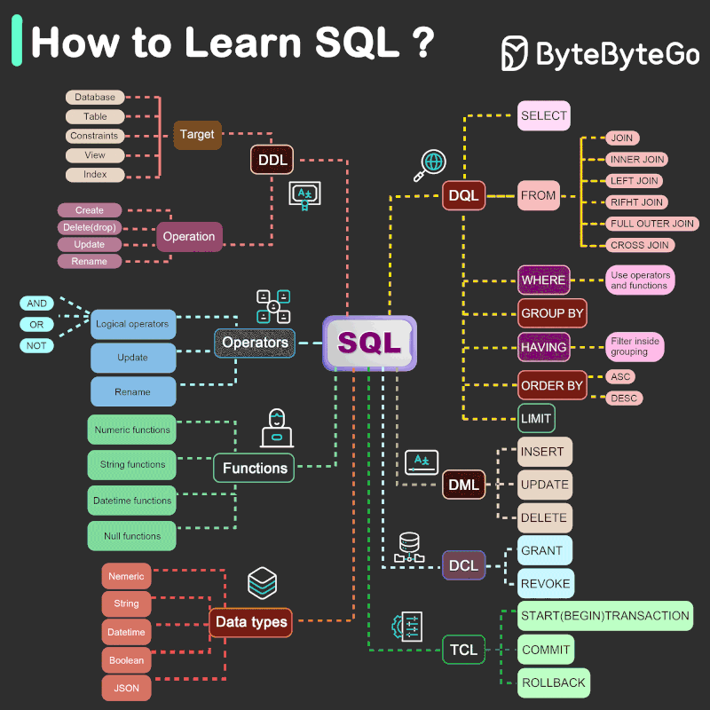

# 🧠 SQL – The Language That Turns Data into Insight

With just a few precise commands, SQL transforms vast, complex datasets into clear, actionable information.  
From identifying trends to optimizing performance, SQL stands as the backbone of **data-driven decision-making**.

Over the past few weeks, I’ve explored SQL more deeply than ever — learning how to think logically, connect data creatively, and write queries that truly **speak the language of data**.

---

  

---

## 📘 My Journey with DBMS and SQL – From Confusion to Confidence

When I first started learning SQL, it felt like a foreign language.  
`CREATE`, `ALTER`, `DROP` — I wondered why so many commands existed just to manage a table.

Gradually, everything started to make sense:

- **DDL, DML, DCL, TCL, DQL** – the grammar that defines how we interact with data.  
- **JOINS** – once confusing, now essential for connecting insights across multiple tables.  
- **Aggregations** – `SUM`, `COUNT`, `AVG` turned raw data into meaningful summaries.  
- **Window Functions & CTEs** – my true *lightbulb moment*, realizing how SQL can handle analytics elegantly.  
- **Data Cleaning** – using `TRIM`, `REPLACE`, `SUBSTRING`, and `ISNULL` to prepare real-world datasets.  

Today, SQL feels less like code and more like a **superpower**.  
Whether it’s cleaning messy data, joining multiple sources, or building analytical reports — SQL remains at the **core of every data-driven decision** I make.

---

## 💡 Key Takeaway

SQL isn’t just about writing queries — it’s about developing a **data mindset**.  
It teaches you to **think in sets, not steps**, and once you adopt that mindset, every dataset becomes an opportunity to discover something valuable.

---

### ⚡ Tools & Concepts I Explored

- Data Definition Language (DDL)  
- Constraints  
- Data Manipulation Language (DML)  
- Data Control Language (DCL)  
- Transaction Control Language (TCL) & ACID Properties  
- Joins & Relationships  
- Subqueries & Common Table Expressions (CTEs)  
- Aggregate & Window Functions  
- Real-world Query Optimization  

---

## 🎯 Conclusion

SQL has transformed the way I think about data — not just as information, but as **insight waiting to be unlocked**.  
This journey strengthened my curiosity, problem-solving mindset, and appreciation for the beauty of data logic.  

✨ **Here’s to continuous learning and the joy of solving problems, one query at a time.** 🧩
